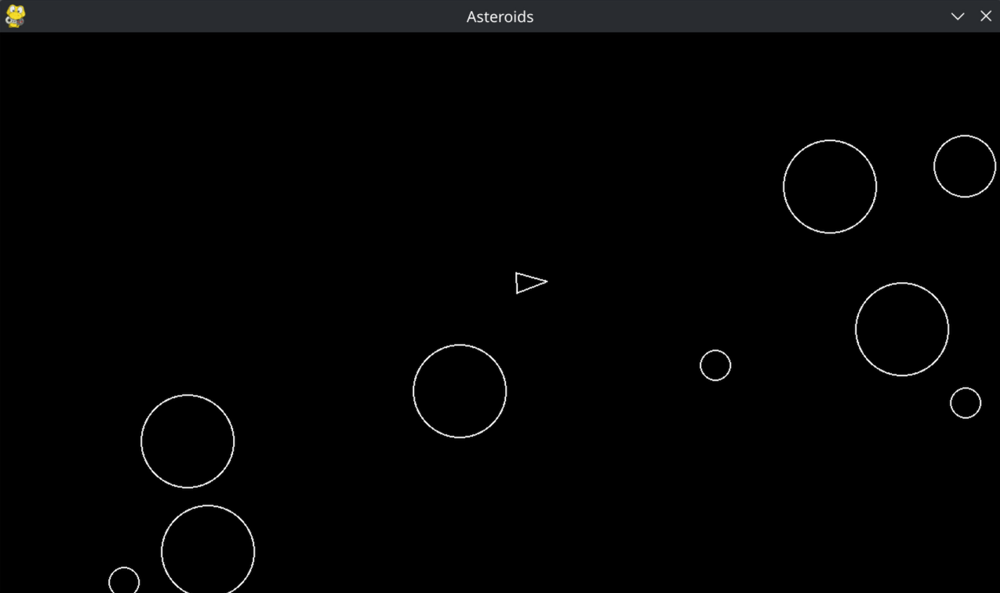

# Asteroids Game
> Simple Python game about shooting asteroids

This project is a part of [boot.dev's](https://www.boot.dev) courses. The goal is to create a functional asteroid shooting game. The user controls
a small ship and shoots small to large asteroids. Large asteroids split into smaller ones until a certain threshold, where they are 
deleted from the game.

## Features

- WASD/SPACE controls
- Infinite asteroid field